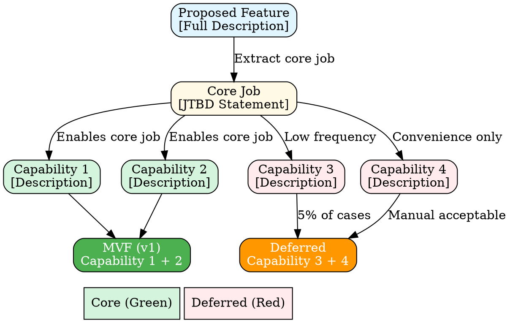

# MVF Scope Reduction

Systematically reduce overly complex features to shippable Minimum Viable Features through structured Socratic interviews. Output includes MVF definition document and optional scope decision diagram.

## Core Concept

A **Minimum Viable Feature (MVF)** is the smallest implementation that:
- Solves the core job-to-be-done for one user segment in one circumstance
- Ships in 1-4 weeks
- Delivers measurable value
- Validates key assumptions

The MVF deliberately defers capabilities to learn from real usage rather than building comprehensively upfront.

## When to Use This Skill

**Clear signals to use MVF scope reduction:**
- Feature described with "and also..." repeatedly
- Multiple user personas or use cases in initial request
- Complex workflows with many branches
- Integration with multiple systems mentioned
- "Would be nice to have" mixed with core requirements
- Words like "comprehensive", "complete", "full-featured", "robust"

**Combine with other skills:**
- Use **feature-spec-jtbd** first to identify the core job-to-be-done
- Use **workflow-mapping** if understanding current operational processes
- Use **mvf-scope-reduction** (this skill) when the job is clear but the solution is too big

## Pre-Interview Preparation

Before starting the interview, complete this analysis:

### 1. List All Proposed Components
Extract every capability, feature, integration, and requirement from the request.

### 2. Hypothesize the Core Job
Based on feature-spec-jtbd or your understanding:
**"When [circumstance], [user] wants to [motivation], so they can [outcome]."**

### 3. Categorize Each Component
Mark each as:
- **CORE**: Essential for the primary job
- **SUPPORTING**: Useful but not critical
- **ENHANCEMENT**: Nice-to-have or serves secondary jobs
- **UNKNOWN**: Need stakeholder input

This pre-work creates your scope reduction map.

## Six-Phase Interview Structure

### Phase 1: Confirm the Core Job (10 min)

Validate your understanding of the essential problem.

**Opening:** "Before we dive into how to build this, let me make sure I understand what you're trying to accomplish. Tell me about the last time you or your team faced this problem."

**Key questions:**
- "What were you trying to accomplish?"
- "How often does this situation come up?"
- "What's at stake when this happens?"

**Goal:** Confirm the job-to-be-done and its frequency/importance.

### Phase 2: Understand Current Pain (10 min)

Identify where the real bottleneck is.

**Key questions:**
- "What do you do today when this comes up?"
- "What's the most painful part of your current approach?"
- "If you had to keep doing it this way for 6 more months, what would it cost you?"

**Goal:** Find the critical pain point—often different from what they initially said.

**Note:** The most painful step often IS the MVF. Everything else may be enhancement.

### Phase 3: Apply Ruthless Prioritization (20 min)

Systematically strip non-essential elements. Use these questions in sequence:

#### Question 1: The Single Priority
**"If you could only ship ONE capability next week, which would you choose?"**

Their immediate answer reveals true priority.

**Follow-up:** "Why that one? What does it enable that nothing else does?"

#### Question 2: The Time Constraint
**"If we had to ship in 2 weeks instead of 2 months, what would we cut?"**

Listen to what they name first—that's least important.

**Follow-up:** "Would what's left still be valuable?"

#### Question 3: The Frequency Test
For each proposed component:
**"How often would someone actually use this?"**

Responses like "occasionally", "sometimes", "rare cases" = defer.

#### Question 4: The Dependency Chain
**"What needs to happen first before this other part becomes useful?"**

This reveals natural sequencing—ship the first part as MVF.

#### Question 5: Edge Case Elimination
**"You mentioned [edge case]. How often does that actually happen?"**

When they say "rarely" or "5% of the time":
**"What if we didn't handle that in version one? What would users do?"**

Often the workaround is acceptable.

#### Question 6: Manual vs. Automated
For each integration or automation:
**"Could a user manually do this for now while we validate demand?"**
**"What's the cost of doing this manually for the first 100 users?"**

**Principle:** If a human can do it, defer the automation.

### Phase 4: Challenge Integrations (10 min)

Integrations multiply complexity. Question each one.

**For each integration:**
- "What job does this integration accomplish?"
- "Could users copy/paste this information instead?"
- "What happens if we just export a CSV for now?"

**Decision criteria:** Does this integration enable the core job, or make it more convenient?
- Enables → Core
- Convenience → Defer

### Phase 5: Test the Reduced Scope (10 min)

Present your stripped-down MVF and gauge reaction.

**Synthesis:** "Based on what you've told me, the core job is [job statement]. To solve that, we need [minimal capabilities]. We can defer [deferred items] until we validate this works. Does that still solve your problem?"

**Watch for:**
- Enthusiastic agreement → You found the essence
- Hesitation → They're attached to something you cut
- Relief → They're grateful for focus

**If resistance:** "Would you actually use [MVF scope]? Would it meaningfully improve your situation even without [deferred item]?"

If yes → MVF is right. If no → you cut too much; add one element back.

### Phase 6: Document Deferral Logic (10 min)

Make deferrals intentional, not rejections.

**Create two lists together:**

**MVF Scope (v1)**:
- [Capability] - because [ties to core job]

**Intentionally Deferred**:
- [Capability] - defer because [low frequency / edge case / needs validation first]

**Key framing:** "This is an intentional deferral, not a rejection. We commit to revisit after validating the core approach."

## Output Requirements

After the interview, create two deliverables:

### 1. MVF Definition Document (Markdown)

Use the template in `assets/mvf-template.md` or this structure:

```markdown
# MVF: [Feature Name]

## Core Job-to-Be-Done
When [circumstance], [user] wants to [motivation], so they can [outcome].

**Frequency:** [How often this occurs]
**Current Pain:** [The critical bottleneck]
**Stakes:** [What's at risk / cost of current approach]

## MVF Scope (v1.0) - Ship by [Date]

1. **[Capability 1]**
   - Enables: [Specific outcome tied to core job]
   - Implementation: [High-level approach]

2. **[Capability 2]**
   - Enables: [Specific outcome tied to core job]
   - Implementation: [High-level approach]

## Success Criteria

- [ ] [Measurable outcome 1]
- [ ] [Measurable outcome 2]
- [ ] [Observable user behavior]

**Target:** [Quantified goal, e.g., "Reduce process time from 30 min to 5 min"]

## Intentionally Deferred Features

| Feature | Rationale for Deferral | Reconsider When |
|---------|------------------------|-----------------|
| [Feature X] | Low frequency (5% of cases) | 100+ users report needing this |
| [Feature Y] | Edge case handling | Core workflow validated |
| [Feature Z] | Automation of manual process | Manual process proves valuable |
| [Integration A] | Convenience, not necessity | Users request it repeatedly |

## Learning Questions

By shipping this MVF, we will learn:

1. [Question about usage patterns]
2. [Question about value delivered]
3. [Question about what's actually needed next]

## Scope Reduction Rationale

**Original Proposal:** [Brief summary of full scope]

**Reduced Because:**
- Primary pain point is [X], which requires only [Y, Z] to solve
- [Deferred items] serve secondary needs or edge cases
- [Integration/automation] can be manual initially
- [Multiple user types/workflows] reduced to [primary segment]

**Stakeholder Agreement:** [Name] confirmed this MVF delivers value and is usable even without deferred capabilities.

## Next Steps After MVF Launch

1. Monitor: [Specific metrics to track]
2. Gather feedback: [How we'll learn from users]
3. Reassess: [When we'll review deferred features]
```

### 2. Scope Decision Diagram (Optional)

Create a visual representation using Graphviz/DOT format showing the scope reduction decision tree.

**When to create:** When the scope reduction involved complex branching logic or when visualizing the decision helps stakeholders understand the rationale.

See `references/diagram-patterns.md` for examples.

**Basic structure:**


## Common Patterns for Scope Reduction

### Pattern: Read-Only Before Read-Write
- MVF: Display and view data
- Defer: Edit, customize, manage

### Pattern: Manual Before Automated
- MVF: Manual trigger with success criteria
- Defer: Scheduled automation, complex rules

### Pattern: Single Persona First
- MVF: Perfect for primary user segment
- Defer: Admin/viewer roles, permissions

### Pattern: Happy Path Only
- MVF: Main workflow succeeds
- Defer: Edge case handling, detailed errors

### Pattern: Internal Tool First
- MVF: Works for team/pilot users
- Defer: Self-service, polish, scale

## Critical Success Factors

**Effective scope reduction when:**
- ✅ Stakeholder enthusiastically agrees MVF is valuable (not just acceptable)
- ✅ MVF timeline is 1-4 weeks
- ✅ Each capability directly enables the core job
- ✅ Deferred items have clear reconsideration triggers
- ✅ Success criteria are specific and measurable
- ✅ Learning questions will inform next iteration

**Warning signs:**
- ⚠️ MVF still feels too big (>4 weeks)
- ⚠️ Stakeholder seems resigned, not convinced
- ⚠️ Can't articulate what you'll learn from shipping this
- ⚠️ Core job still unclear or too broad

## Handling Resistance

**"This won't be complete"**
→ "Will it be useful? Can we validate assumptions? That's complete enough to learn."

**"Competitors have all these features"**
→ "How long did it take them? Let's ship the core faster and surpass them where it matters most."

**"We should do it right the first time"**
→ "'Right' means solving the real problem. We don't know what 'right' fully looks like until we see it in use."

**"Users will give bad feedback"**
→ "If they want more, that means we built something worth expanding. Silence is the risky feedback."

## Key Principles

1. **Focus ruthlessly on the job-to-be-done** - Everything in MVF must directly enable it
2. **Defer, don't deny** - Make deferrals intentional and visible
3. **Manual > Automated** - If humans can do it, defer automation
4. **One segment, one circumstance** - Don't solve for multiple types/situations in v1
5. **Learning is the goal** - Build enough to test assumptions
6. **Stakeholder consensus required** - They must believe it's valuable, not just tolerable

## Resources

### references/questions.md
Comprehensive question bank organized by scope reduction pattern. Load when you need deeper questioning strategies beyond core interview questions.

### references/diagram-patterns.md
Graphviz/DOT examples for different scope reduction scenarios. Load when creating decision tree diagrams.

### assets/mvf-template.md
Complete Markdown template for MVF documentation. Copy to start a new MVF definition document.
