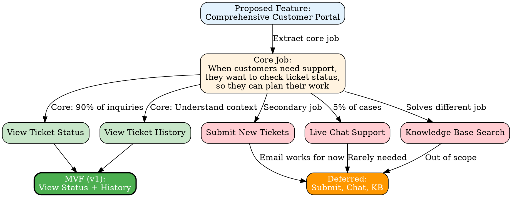
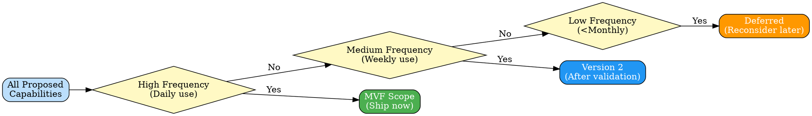
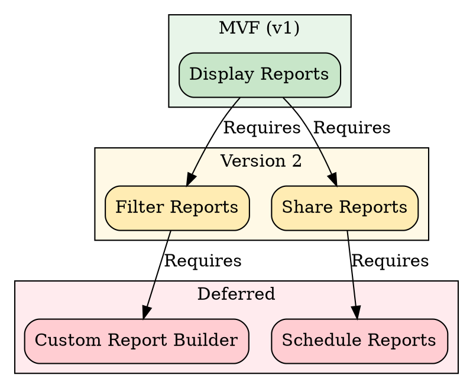
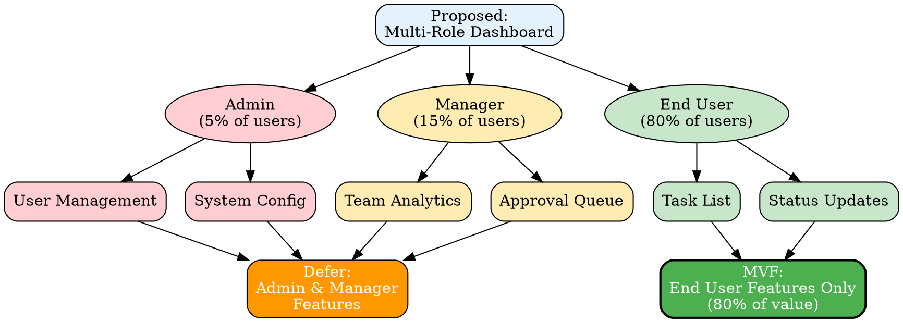
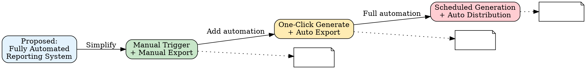
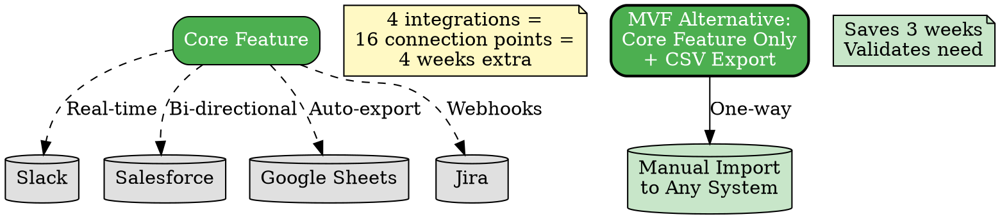
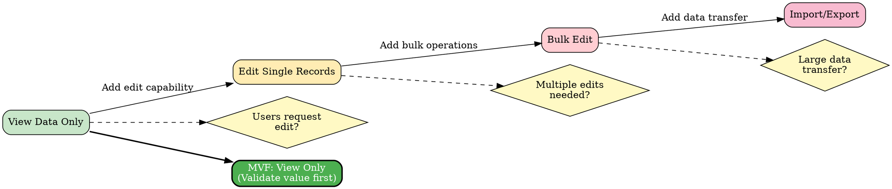
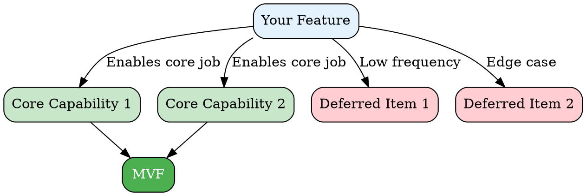

# Diagram Patterns for MVF Scope Reduction

Graphviz/DOT examples for visualizing scope reduction decisions. Use when creating decision tree or scope reduction diagrams.

## Pattern 1: Simple Scope Reduction Tree

Shows which capabilities are core vs. deferred with rationale.



## Pattern 2: Frequency-Based Reduction

Shows scope decisions based on frequency of use.



## Pattern 3: Dependency Chain

Shows the natural sequence of capabilities and which to ship first.



## Pattern 4: User Persona Reduction

Shows how reducing to one persona simplifies scope.



## Pattern 5: Manual to Automated Path

Shows progression from manual to automated features.



## Pattern 6: Integration Complexity

Shows how many integrations multiply complexity.



## Pattern 7: Edge Case Elimination

Shows the long tail of edge cases and where to draw the line.

```dot
digraph edge_cases {
    rankdir=TB;
    node [shape=box, style=rounded];

    HAPPY [label="Happy Path\n(80% of cases)", style="rounded,filled", fillcolor="#c8e6c9"];

    COMMON [label="Common Variations\n(15% of cases)", style="rounded,filled", fillcolor="#ffecb3"];

    EDGE [label="Edge Cases\n(4% of cases)", style="rounded,filled", fillcolor="#ffcdd2"];

    RARE [label="Rare Edge Cases\n(1% of cases)", style="rounded,filled", fillcolor="#f8bbd0"];

    HAPPY -> COMMON [label="Add handling"];
    COMMON -> EDGE [label="Add handling"];
    EDGE -> RARE [label="Add handling"];

    // MVF cutoff
    MVF_LINE [label="MVF Cutoff", shape=plaintext, fontsize=14, fontcolor="red"];

    HAPPY -> MVF_LINE [style=invis];

    // Effort vs. Value
    EFFORT [label="Development Effort:\n2 weeks → 4 weeks → 6 weeks → 8 weeks",
            shape=note, style=filled, fillcolor="#fff3e0"];
    VALUE [label="User Value:\n80% → 95% → 99% → 100%",
           shape=note, style=filled, fillcolor="#e8f5e9"];

    {rank=same; HAPPY; COMMON; EDGE; RARE;}
}
```

## Pattern 8: Read-Only to Read-Write

Shows the progression from viewing to editing capabilities.



## Pattern 9: Complete Feature Breakdown

Comprehensive view showing all reduction decisions.

```dot
digraph complete_breakdown {
    rankdir=TB;
    node [shape=box, style=rounded];

    PROPOSAL [label="Original Proposal:\nEnterprise Analytics Platform",
              style="rounded,filled", fillcolor="#e3f2fd", penwidth=2];

    // Categories
    DATA [label="Data Layer", style="rounded,filled", fillcolor="#f0f0f0"];
    VIZ [label="Visualizations", style="rounded,filled", fillcolor="#f0f0f0"];
    COLLAB [label="Collaboration", style="rounded,filled", fillcolor="#f0f0f0"];
    ADMIN [label="Administration", style="rounded,filled", fillcolor="#f0f0f0"];

    PROPOSAL -> DATA;
    PROPOSAL -> VIZ;
    PROPOSAL -> COLLAB;
    PROPOSAL -> ADMIN;

    // Data capabilities
    D1 [label="Connect to DB", style=filled, fillcolor="#c8e6c9"];
    D2 [label="Real-time Sync", style=filled, fillcolor="#ffcdd2"];
    D3 [label="Data Transformations", style=filled, fillcolor="#ffcdd2"];

    DATA -> D1;
    DATA -> D2;
    DATA -> D3;

    // Viz capabilities
    V1 [label="Basic Charts", style=filled, fillcolor="#c8e6c9"];
    V2 [label="Custom Dashboards", style=filled, fillcolor="#ffecb3"];
    V3 [label="Interactive Filters", style=filled, fillcolor="#ffcdd2"];

    VIZ -> V1;
    VIZ -> V2;
    VIZ -> V3;

    // Collab capabilities
    C1 [label="Share Reports", style=filled, fillcolor="#ffecb3"];
    C2 [label="Comments", style=filled, fillcolor="#ffcdd2"];
    C3 [label="Email Scheduling", style=filled, fillcolor="#ffcdd2"];

    COLLAB -> C1;
    COLLAB -> C2;
    COLLAB -> C3;

    // Admin capabilities
    A1 [label="User Management", style=filled, fillcolor="#ffcdd2"];
    A2 [label="Permissions", style=filled, fillcolor="#ffcdd2"];
    A3 [label="Audit Logs", style=filled, fillcolor="#ffcdd2"];

    ADMIN -> A1;
    ADMIN -> A2;
    ADMIN -> A3;

    // MVF box
    subgraph cluster_mvf {
        label="MVF (2 weeks)";
        style="rounded,filled";
        fillcolor="#e8f5e9";
        penwidth=2;
        D1; V1;
    }

    // v2 box
    subgraph cluster_v2 {
        label="Version 2 (4 weeks)";
        style="rounded,filled";
        fillcolor="#fff9e6";
        V2; C1;
    }

    // Deferred box
    subgraph cluster_defer {
        label="Deferred";
        style="rounded,filled";
        fillcolor="#ffebee";
        D2; D3; V3; C2; C3; A1; A2; A3;
    }
}
```



## Creating Your Own Diagram

### Basic Template



### Color Scheme

Use these colors for consistency:
- **Core/MVF**: `fillcolor="#c8e6c9"` (light green) or `fillcolor="#4caf50"` (green) for MVF box
- **Version 2**: `fillcolor="#ffecb3"` (light yellow) or `fillcolor="#2196f3"` (blue)
- **Deferred**: `fillcolor="#ffcdd2"` (light red) or `fillcolor="#ff9800"` (orange)
- **Proposals/Context**: `fillcolor="#e3f2fd"` (light blue)
- **Decision points**: `fillcolor="#fff9c4"` (pale yellow)

### Rendering

To render the diagram:

```bash
# Create .dot file
cat > scope-diagram.dot << 'EOF'
[paste your dot code here]
EOF

# Render to PNG
dot -Tpng scope-diagram.dot -o scope-diagram.png

# Or render to SVG
dot -Tsvg scope-diagram.dot -o scope-diagram.svg
```

### Tips

1. **Keep it simple**: Don't try to show every detail
2. **Use grouping**: Subgraphs and clusters help organize
3. **Add context**: Labels explain decisions
4. **Show rationale**: Edge labels explain why things are deferred
5. **Use visual hierarchy**: Size, color, and position convey importance
