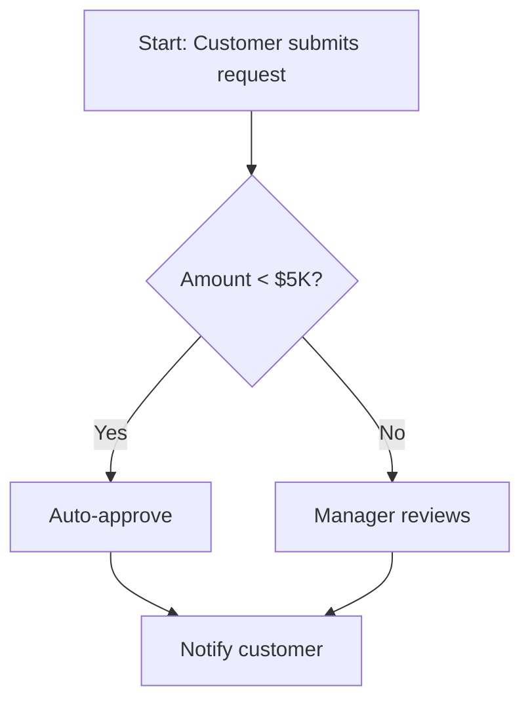

# Workflow Mapping

Map operational workflows through Socratic stakeholder interviews to inform feature specifications.

## Overview

Workflow mapping uses structured interviews to document how work gets done today—not the idealized process, but the reality of steps, actors, decisions, handoffs, and pain points. The output is detailed workflow documentation (Markdown) and visual diagrams (Mermaid) that inform feature specifications.

This complements the feature-spec-jtbd skill by providing operational detail about *how* jobs are currently accomplished.

## Workflow Decision Tree

**Use workflow-mapping when:**
- User says: "Help me understand our current process for..."
- You need to: Document step-by-step operations
- You need to: Identify bottlenecks and handoffs
- Context: Defining features that change existing workflows

**Use feature-spec-jtbd when:**
- User says: "We need to build..."
- You need to: Understand the underlying job-to-be-done
- You need to: Validate whether to build at all
- Context: Starting from vague feature requests

**Use both when:**
- Building features that optimize or replace existing processes
- First use JTBD to understand the "why", then workflow-mapping to understand the "how"

## Interview Process

The workflow mapping interview follows six phases. Always ground in a specific recent instance, not theoretical processes.

### Phase 1: Select a Recent Instance

Ground the conversation in reality by choosing a specific, recent example.

**Key questions:**
- "Can you think of the most recent time you completed [process]?"
- "When was that? What day approximately?"
- "What prompted you to start?"
- "Was this typical, or was something unusual about it?"

**Goal:** Prevent idealized descriptions by focusing on actual events.

### Phase 2: Map the Linear Flow

Document the sequence of steps from trigger to completion.

**Question pattern:**
- "What was the very first thing you did?"
- "What did you do next?"
- "And after that?"
- "How did you know you were done?"

**For each step, capture:**
- Action verb (opened, reviewed, calculated, approved, sent)
- Tool/system used
- Input information
- Output created
- Approximate duration

**Example notation:**
```
Step 1: Received email notification from support [2 min]
  → Input: Case #, customer name, issue type
  → Tool: Outlook
Step 2: Opened case in CRM to review history [5 min]
  → Input: Case details, previous interactions
  → Tool: Salesforce
  → Output: Understanding of context
```

### Phase 3: Identify Actors and Handoffs

Map who's involved and where work passes between people.

**Key questions:**
- "Who else was involved in this process?"
- "At what point did you need to involve them?"
- "How did you communicate with them?"
- "What information did you need to give them?"
- "How long does that usually take?"

**For each handoff:**
- What exactly was sent (format, location, method)
- What context was needed
- How they know it's complete
- What happens if there's no response

### Phase 4: Uncover Decision Points

Identify where workflow branches based on conditions.

**Look for:** "If...", "Sometimes...", "Depending on...", "Unless..."

**Key questions:**
- "You said 'if [condition]'—tell me more about that decision"
- "What are all the possible options at this point?"
- "What information do you use to make that decision?"
- "Walk me through an example of each path"

**Capture:**
- All possible branches
- Decision criteria (specific vs. judgment)
- Edge cases and escalation paths

### Phase 5: Discover Bottlenecks and Pain Points

Identify where workflow breaks down or slows down.

**Key questions:**
- "Which step takes the longest?"
- "Where do you find yourself waiting?"
- "What's the most annoying part?"
- "Where do mistakes usually happen?"
- "What shortcuts have you developed?"

**Watch for workarounds:** These reveal where the process fails and what matters most.

**Quantify impact:**
- How often does this problem occur?
- How much time does it cost?
- How many people are affected?
- What's the impact if this goes wrong?

### Phase 6: Validate the Complete Model

Confirm accuracy and identify gaps.

**Playback technique:**
- Walk through your documented workflow step by step
- Sketch it visually
- Ask: "Is this accurate?"
- Watch for hesitation—it reveals errors

**Gap-finding questions:**
- "What did I miss?"
- "Are there parallel processes happening?"
- "Who else does this differently?"
- "What happens during emergencies?"

## Creating Deliverables

After the interview, create both detailed documentation and visual diagrams.

### 1. Workflow Markdown Document

Use the template in `assets/workflow-template.md` or create from this structure:

```markdown
## [Workflow Name]

**Trigger**: What starts the process
**Actors**: Who's involved (with roles)
**Frequency**: How often this happens
**Average Duration**: Start to finish time

### Steps

1. **[Actor]**: [Action verb] [object]
   - Tool: [System/platform]
   - Input: [Required information]
   - Output: [What is created/decided]
   - Duration: [Time estimate]
   - Notes: [Context, pain points]

### Decision Points

- **At Step X**: [Condition]
  - Option A: [Outcome] → Step Y
  - Option B: [Outcome] → Step Z

### Handoffs

- Step X to Y: [Actor A] → [Actor B]
  - Method: [Transfer mechanism]
  - Wait time: [Typical duration]

### Bottlenecks

1. [Step description]
   - Impact: [Quantified cost]
   - Frequency: [How often]
   - Root cause: [Why it happens]
```

### 2. Mermaid Workflow Diagram

Create a visual flowchart. See `references/mermaid-patterns.md` for examples.

**Basic structure:**


**Use colors to indicate:**
- Normal path (green): `style C fill:#90EE90`
- Bottlenecks (red): `style D fill:#ffcccc`
- Decision points (yellow): `style B fill:#ffffcc`

### 3. Bottleneck Analysis Table

| Step | Issue | Frequency | Impact | Workarounds | Potential Solutions |
|------|-------|-----------|--------|-------------|---------------------|
| Legal review | 5-7 day wait | Every request | 30% miss deadline | Direct email | Auto-routing by complexity |

## Best Practices

**Do:**
- ✅ Focus on a specific recent instance (not "usually we...")
- ✅ Draw the workflow in real-time for visual feedback
- ✅ Use their terminology—don't translate yet
- ✅ Follow tangents about pain points
- ✅ Ask to see actual artifacts (emails, spreadsheets, forms)

**Don't:**
- ❌ Suggest solutions during the interview—just learn
- ❌ Judge their process, even if inefficient
- ❌ Accept "it's complicated"—push for specifics
- ❌ Interview in a conference room—go to their workspace
- ❌ Take notes during sensitive topics

**Critical listening skills:**
- Listen for verbs: "open, review, calculate, approve"—these are steps
- Listen for time markers: "then, after, while"—these reveal sequence
- Listen for conditionals: "if, when, unless"—these are decision points
- Listen for emotion: frustration, pride, anxiety—these flag important areas

## Integration with Feature Specifications

Link workflow findings to feature requirements:

1. **Reference the JTBD:** How does this step relate to the job?
2. **Assess impact:** Frequency × Duration × # people = Total cost
3. **Explore solutions:**
   - Eliminate: Can we remove this step?
   - Automate: Can software do this?
   - Integrate: Can we reduce context switching?
   - Parallel: Can this happen simultaneously?
4. **Define success metrics:**
   - Current state: "Takes 30 minutes, 5 days"
   - Target state: "Takes 5 minutes, 1 day"

## Quick Reference: Essential Questions

**Opening**
- "Tell me about the last time you did [process]..."

**Sequencing**
- "What did you do first? Next? After that?"

**Actors**
- "Who else was involved? At what point?"

**Decisions**
- "You said 'if'—tell me more about that decision..."

**Tools**
- "What tool did you use for that?"

**Time**
- "How long did this step take?"
- "Where do you spend the most time?"

**Pain Points**
- "What's the most frustrating part?"
- "What workarounds have you developed?"

**Validation**
- "Is this accurate: [playback]?"
- "What am I missing?"

## Resources

### references/questions.md
Comprehensive question library organized by interview phase. Load when you need deeper question options beyond the quick reference above.

### references/mermaid-patterns.md
Common Mermaid diagram patterns for different workflow types (sequential, branching, parallel, cross-functional). Load when creating diagrams.

### assets/workflow-template.md
Complete Markdown template for workflow documentation. Copy this to start a new workflow document.
