# Mermaid Workflow Diagram Patterns

Load this file when creating workflow diagrams. It provides templates and examples for common workflow visualization patterns using Mermaid.

## Basic Sequential Workflow

Simple linear process with no branches:

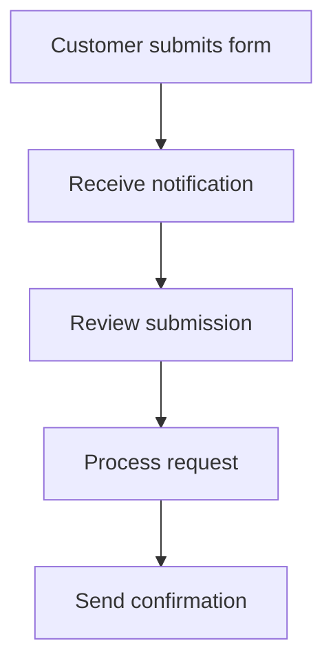

## Decision Point Workflow

Process with conditional branches:

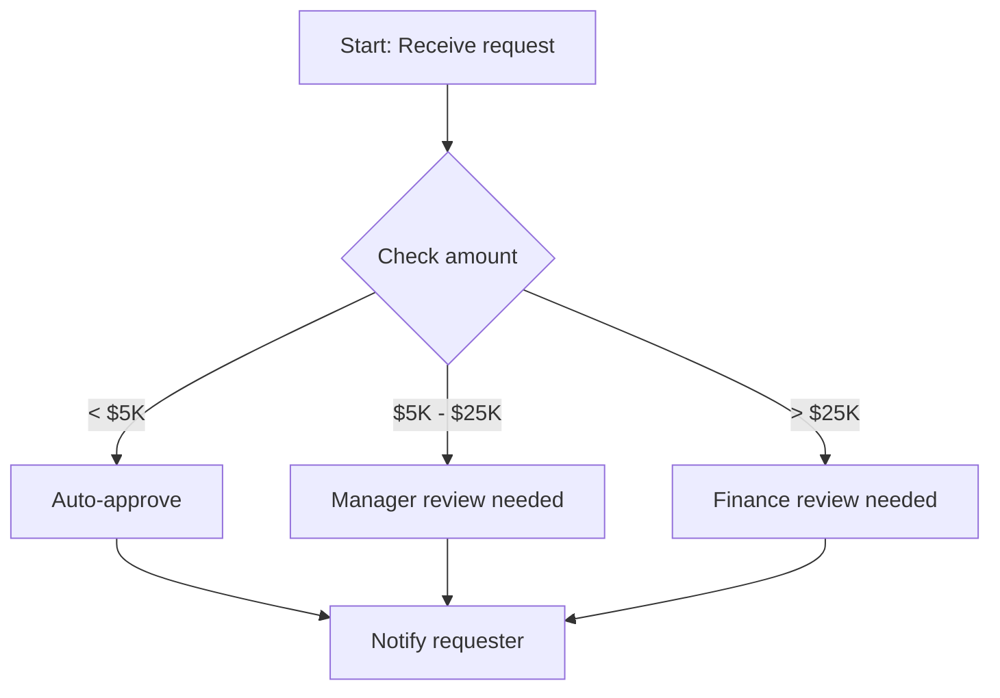

## Approval Workflow with Rejection Path

Process with approval/rejection loops:

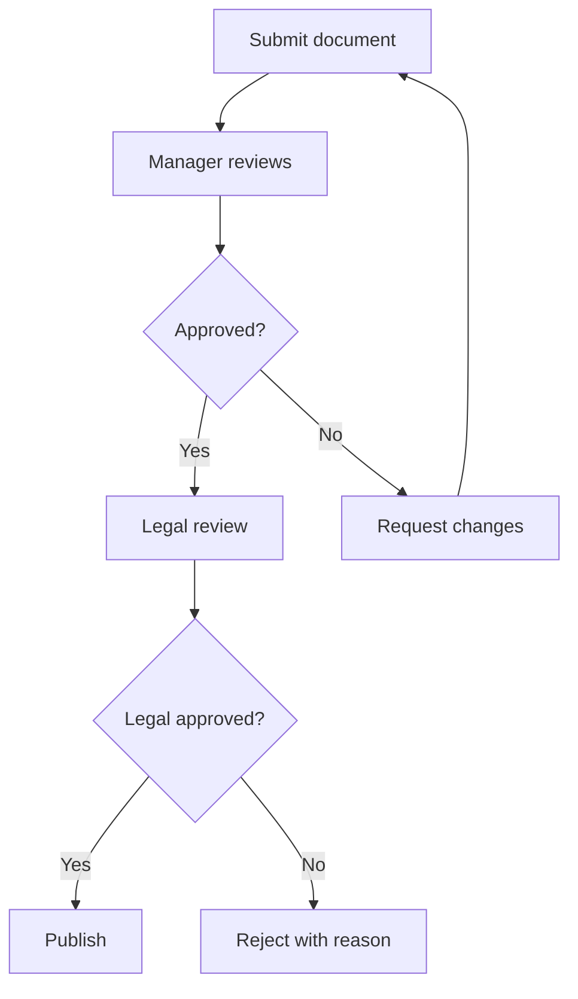

## Parallel Process Workflow

Steps that can happen simultaneously:

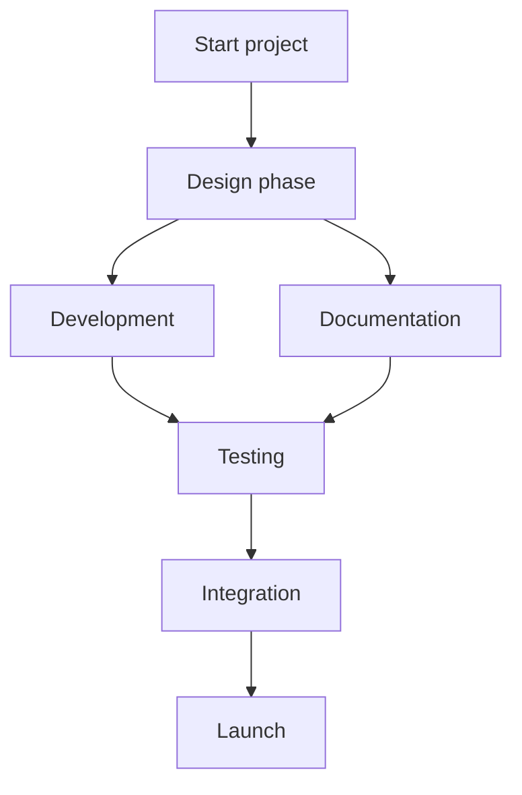

## Multi-Actor Swimlane Workflow

Using subgraphs to show who does what:

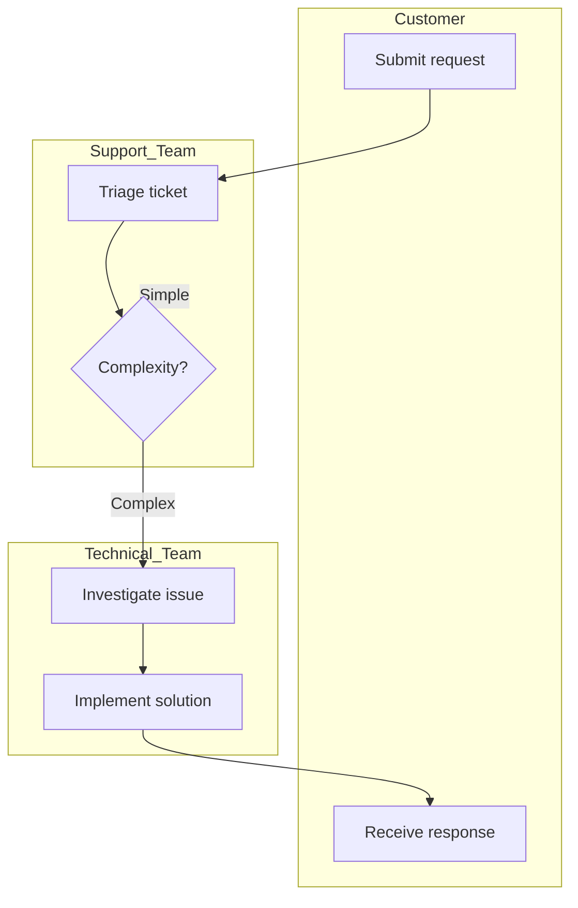

## Error Handling and Retry Logic

Process with failure paths:

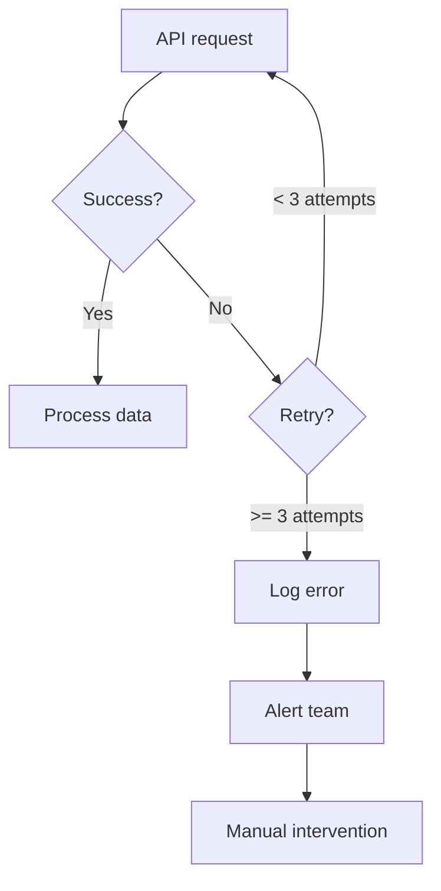

## Long-Running Process with Checkpoints

Process with save points:

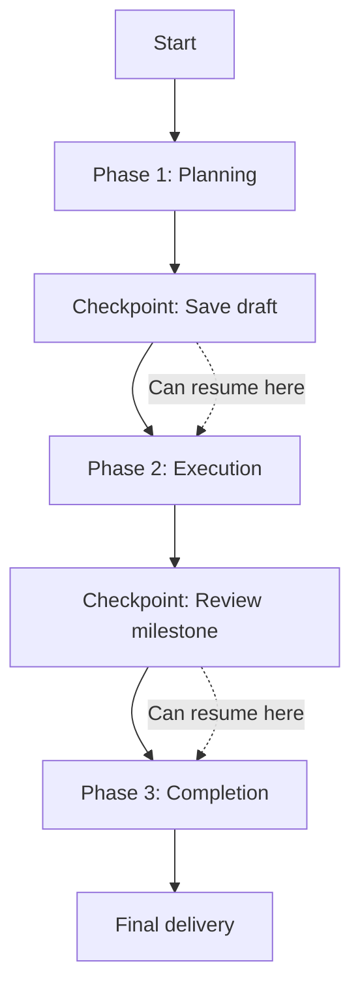

## Workflow with Handoffs and Wait States

Showing bottlenecks and waiting periods:

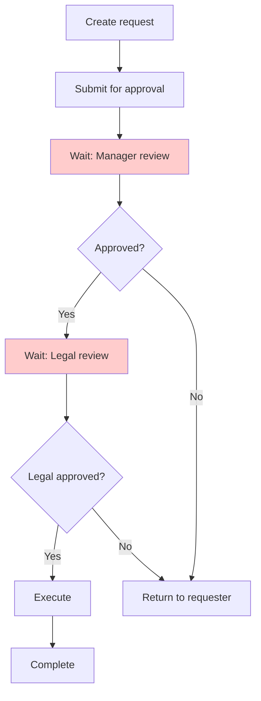

## Color Coding for Workflow States

Use colors to indicate different types of steps:

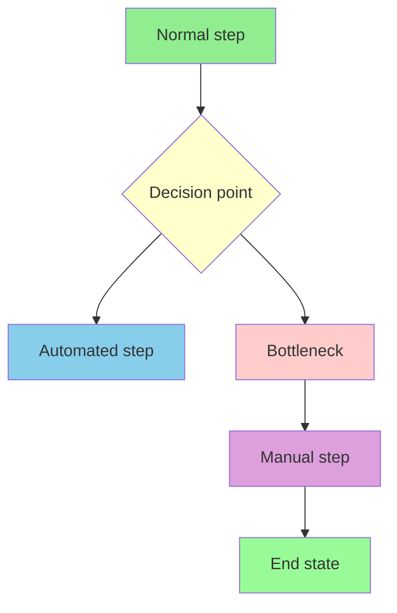

## Style Reference

Common color codes for workflow elements:

- `style X fill:#90EE90` - Normal/happy path (light green)
- `style X fill:#ffcccc` - Bottleneck/problem area (light red)
- `style X fill:#ffffcc` - Decision point (light yellow)
- `style X fill:#87CEEB` - Automated step (light blue)
- `style X fill:#DDA0DD` - Manual/human step (light purple)
- `style X fill:#FFE4B5` - Waiting state (moccasin)
- `style X fill:#98FB98` - Completion (pale green)

## Arrow Types

Different arrow styles for different relationships:

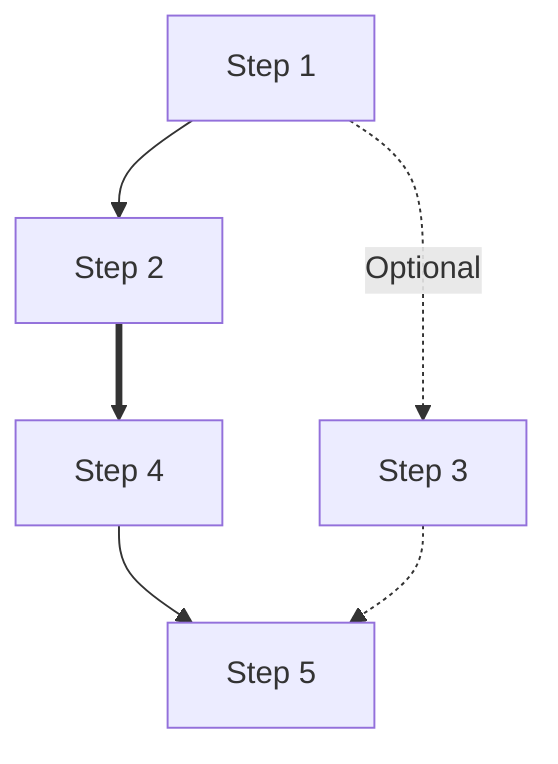

- `-->` Solid arrow (normal flow)
- `-.->` Dotted arrow (optional/conditional)
- `==>` Thick arrow (primary/critical path)

## Complex Real-World Example: Purchase Request Process

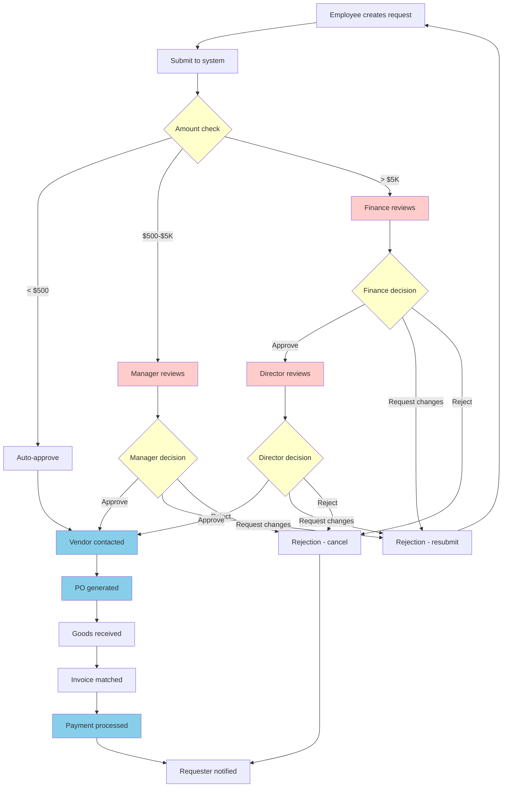

## Tips for Effective Diagrams

1. **Keep nodes concise**: Use short labels (< 5 words)
2. **Show the critical path**: Use thicker arrows or colors
3. **Highlight pain points**: Use red/orange for bottlenecks
4. **Limit complexity**: Break very complex workflows into multiple diagrams
5. **Add a legend**: When using colors, explain what they mean
6. **Test rendering**: Verify the diagram displays correctly
7. **Use consistent direction**: Top-to-bottom (TD) is most common
8. **Group related steps**: Use subgraphs for different actors or systems

## When to Use Which Pattern

- **Sequential**: Simple, linear processes without branches
- **Decision Point**: Processes with clear branching logic
- **Approval**: Document review and approval workflows
- **Parallel**: Tasks that can happen simultaneously
- **Swimlane**: When showing responsibilities across teams
- **Error Handling**: Processes with retry/failure logic
- **Checkpoints**: Long processes with save points
- **Handoffs**: When highlighting waiting periods and bottlenecks
